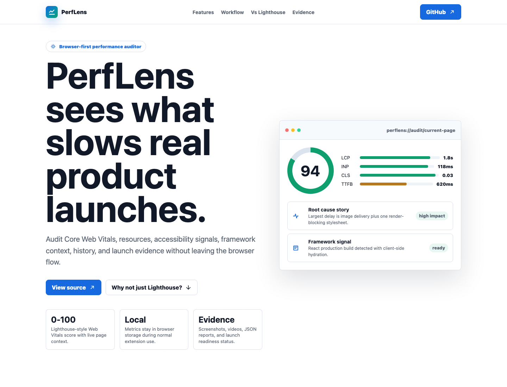
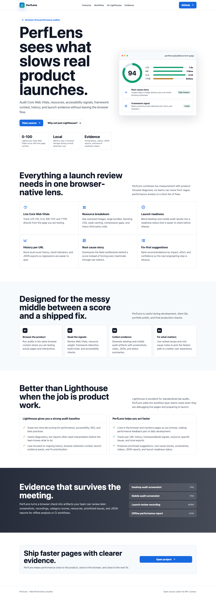
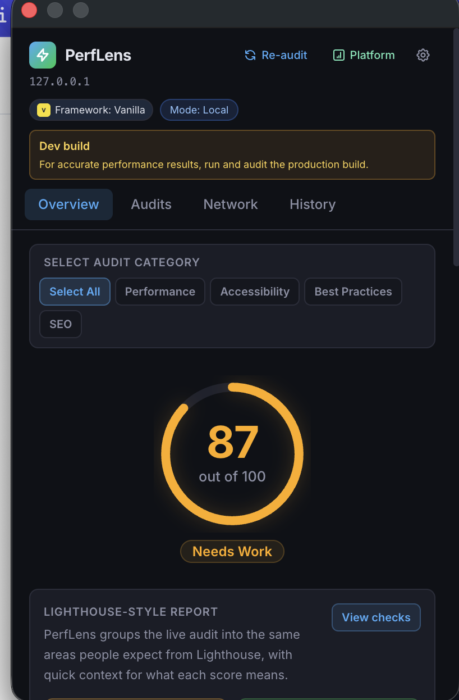
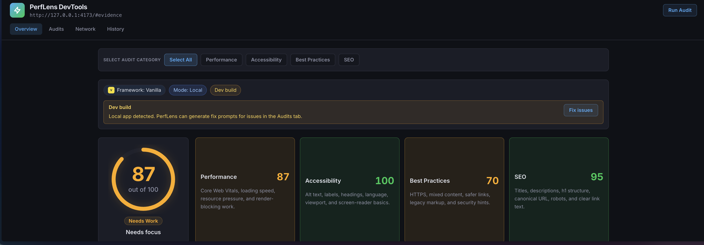
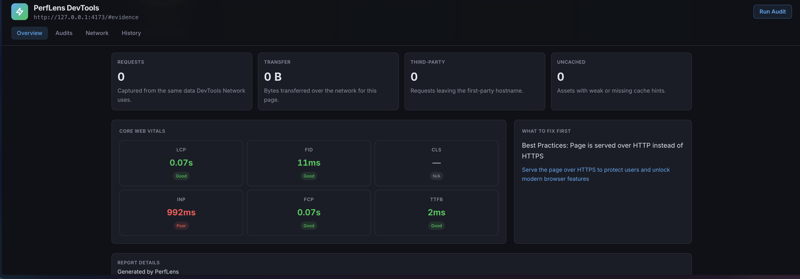
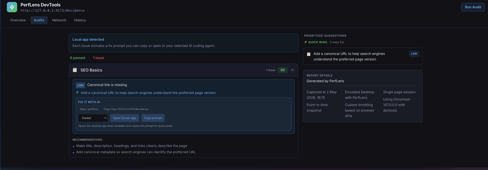
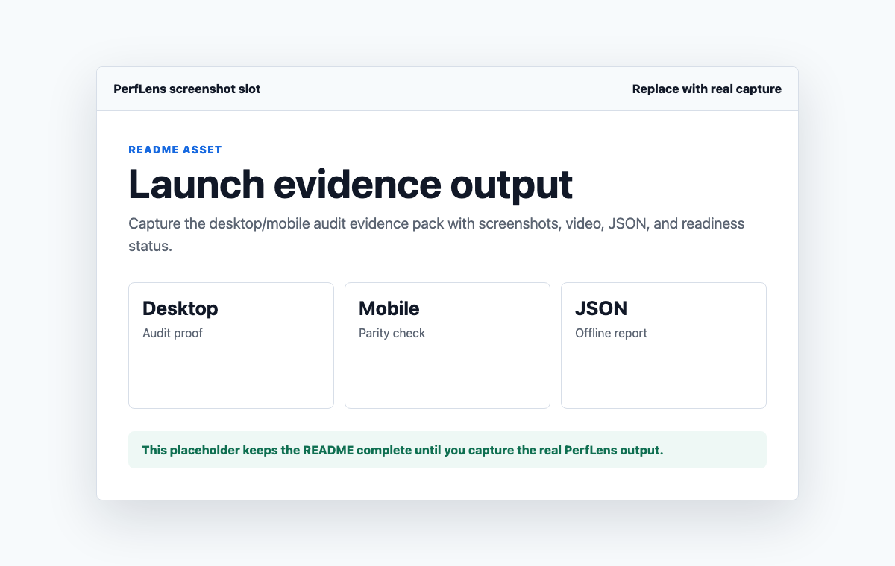

# PerfLens - Web Performance Auditor

PerfLens is a browser-first performance auditing extension for developers preparing real products for launch. It gives you live Core Web Vitals, Lighthouse-style scoring, resource diagnostics, root cause summaries, performance history, and launch evidence directly inside the browser workflow.



## Why PerfLens Exists

Lighthouse is excellent for standardized audits, but product teams often need more than a one-time score. PerfLens keeps performance feedback closer to the page you are testing, the release you are preparing, and the fixes you need to prioritize next.

PerfLens is built around a simple idea:

> Performance auditing should be closer to the browser, closer to the product, and closer to the next fix.

## Features

- **Live Core Web Vitals:** LCP, FID, CLS, INP, FCP, and TTFB.
- **0-100 performance score:** Lighthouse-style weighting with browser badge health colors.
- **Resource diagnostics:** oversized images, missing lazy loading, render-blocking scripts, large bundles, weak caching, compression gaps, and heavy stylesheets.
- **Accessibility checks:** missing alt text, missing language attributes, viewport issues, heading hierarchy issues, and unlabeled forms.
- **Actionable suggestions:** recommendations ranked by estimated impact, implementation effort, and confidence.
- **Root cause story:** a concise explanation of likely bottlenecks behind the current score.
- **Framework and build detection:** React, Vue, Angular, Svelte, Next.js, Nuxt, Gatsby, Remix, Astro, Solid, Qwik, Preact, Ember, Backbone, jQuery, vanilla JavaScript, and production/development build hints.
- **History per URL:** local score history, trend indicators, and JSON exports.
- **Launch evidence packs:** desktop and mobile audits with screenshots, videos, category scores, resource data, prioritized issues, readiness status, and JSON reports.
- **Privacy-friendly defaults:** normal metric collection uses browser-native APIs and stores data locally with `chrome.storage.local`.

## Extension Permissions

PerfLens uses current-tab access by default. It runs only when you click an audit action in the popup or DevTools panel, so it does not require broad all-site access or automatic page monitoring.

Build the extension with:

```bash
npm run build
```

## Screenshots



### Extension And DevTools Output









### Additional Marketing Assets



Useful future captures:

- Root Cause Story panel.
- History chart for a URL.
- Desktop/mobile launch evidence pack.
- JSON report or exported audit summary.

## PerfLens vs Lighthouse

PerfLens does not need to dismiss Lighthouse to be useful. Lighthouse is great for standardized lab scoring. PerfLens is stronger when the work is day-to-day product debugging and launch readiness.

| Lighthouse | PerfLens |
| --- | --- |
| Great one-time audit baseline | Live browser-context monitoring |
| Strong lab report | Ongoing per-URL history and trend signals |
| Useful diagnostics | Fix-first suggestions ranked by impact, effort, and confidence |
| Separate report workflow | Extension workflow while browsing and testing |
| General audit categories | Framework/build detection and root cause stories |
| Exportable report | Launch evidence packs with screenshots, videos, JSON, prioritized issues, and readiness status |

## Landing Page

The marketing landing page is available in [index.html](./index.html). It includes:

- Hero positioning for PerfLens
- Product-style audit mockup
- Full feature grid
- Workflow section
- Lighthouse comparison section
- Launch evidence section
- GitHub call to action


## AI Agent Prompt

Use [LANDING_PAGE_PROMPT.md](./LANDING_PAGE_PROMPT.md) to have another AI agent recreate or extend the landing page with the right product context, visual direction, and Lighthouse comparison messaging.

## Tech Stack

- TypeScript
- React
- Tailwind CSS
- Vite
- Chrome Manifest V3
- Pure SVG charts
- Chrome extension APIs
- Playwright for the platform audit engine

## Roadmap

- Framework-aware deep rules
- Third-party script ROI analysis
- Performance regression guards
- Baseline snapshots
- What-if performance simulations
- One-click patch previews
- User journey performance maps
- Energy and battery impact insights
- Competitive benchmark mode
